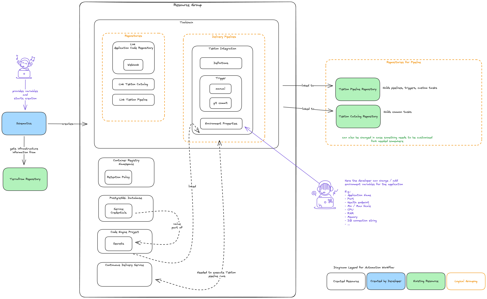

# IBM Cloud Client Engineering MVP Infrastructure

## TLDR

Fast start steps either from local machine or from IBM Cloud via **Schematics**.

### Local

Prerequisites:

1. Terraform CLI must be installed
2. Create an IBM Cloud API Key
3. Provide the following values in the `terraform.tfvars` file or when prompted on the cli:
   1. `ibmcloud_api_key` - IBM Cloud API Key
   2. `pg_admin_password` - Password for the PostgreSQL `admin` user
   3. `code_repository_url` - URL to the code repository to be deployed

```sh
git clone https://github.com/fabianschwab/ic-ce-mvp-infrastructure.git
cd ic-ce-mvp-infrastructure

terraform init
terraform apply
```

### IBM Cloud

Prerequisites:

1. Create an IBM Cloud API Key

Steps:

1. Goto *Platform Automation* --> *Schematics* --> *Terraform*
2. Click *Create Workspace*
3. Provide git repo `https://github.com/fabianschwab/ic-ce-mvp-infrastructure.git` and click *next*
4. Provide a workspace name and click *next*
5. Click *Create*

You be redirected to the workspace page.

1. Goto *Settings* tab and change the variables as needed.
   1. Needed are `ibm_cloud_api_key`, `pg_admin_password` and `code_repository_url`
2. Click *Plan* and then *Apply*

## Overview

This project is based on the [Develop a Code Engine app](https://cloud.ibm.com/devops/setup/deploy?repository=https%3A%2F%2Feu-de.git.cloud.ibm.com%2Fopen-toolchain%2Fcode-engine-toolchain&env_id=ibm:yp:eu-de) IBM Cloud Toolchain.

It basically does the same only a bit more simplified. E.g. it does not do all the pipeline steps and does not create forks of the repositories for the pipeline.
The aim is to have an easy to use infrastructure for the MVP, which deploys a application based on the `Dockerfile` in the code repository and sets up a **PostgreSQL** instance.
The **PostgreSQL** instance is the smallest available plan and the credentials are stored in a **Code Engine** secret and can be used by the application to connect to the database.
The environment variable with the connection string is `POSTGRESQL`.

This repository contains the infrastructure code as terraform scripts.
It sets up the following resources:

- Resource Group
- Container Registry Namespace
  - Retention Policy (10 images per repository)
  - The name has a random suffix to avoid name collisions
- PostgreSQL Instance
  - Service Credentials
- Code Engine Project
  - Code Engine Application
    - Secret for PostgreSQL
- Continuous Delivery Service for executing the tekton pipelines
- Toolchain
  - Repositories
    - Links the code repository provided as variable
    - Links the tekton pipeline repository
    - Links the tekton catalog repository
  - Delivery Pipeline
    - Tekton Pipeline Definition
    - Tekton Pipeline Environment Properties
    - Tekton Pipeline Triggers
      - Manuel Trigger
      - Git Trigger for *commit* on `main` branch



## Create Infrastructure

You can create the infrastructure either from your local machine or from IBM Cloud via **Schematics**.

### IBM Cloud Schematics

1. Login to your IBM Cloud Account
2. Goto *Platform Automation* --> *Schematics* --> *Terraform*
3. Click *Create Workspace*
4. Provide the link to this repository `https://github.com/fabianschwab/ic-ce-mvp-infrastructure.git`
5. Click *Next*
6. Provide a name for the workspace
7. Click *Next*
   1. Select your region e.g. `Frankfurt`
   2. Select your resource group e.g. `Default`
8. *Create*

Your workspace is created and you are redirected to the settings page.

After you have [configured the infrastructure](#configure-infrastructure) you can create it by clicking on the *Plan* button and then *Apply*.
This will create all the resources and but is not yet deploying the application.

### Local with Terraform CLI

1. Clone this repository `git clone https://github.com/fabianschwab/ic-ce-mvp-infrastructure.git`
2. Install the [Terraform CLI](https://developer.hashicorp.com/terraform/install)
3. [Configure the infrastructure](#configure-infrastructure)
   1. Change the values in a `terraform.tfvars` file or provide them when prompted on the cli
4. Run `terraform init` to initialize the terraform provider for IBM Cloud
5. Run `terraform validate` to validate the configuration
6. Run `terraform plan` to see what will be created
7. Run `terraform apply` to create the infrastructure

## Configure Infrastructure

Before you create all the infrastructure you can modify it by providing a few values.
Most of them have default values and are fine as they are but some needed to be changed.

| Name                            | Description                                                                                                 | Type   | Default                                                           | Sensitive |
| ------------------------------- | ----------------------------------------------------------------------------------------------------------- | ------ | ----------------------------------------------------------------- | --------- |
| ibm_cloud_api_key               | IAM API Key                                                                                                 | string |                                                                   | true      |
| ibm_region                      | Region and zone the resources should be created in.                                                         | string | eu-de                                                             |           |
| resource_group_name             | Name of resource group to provision resources.                                                              | string | development                                                       |           |
| code_engine_project_name        | Name for the CodeEngine project which holds the applications                                                | string | mvp-development                                                   |           |
| container_registry_name         | Container registry namespace name which holds the images for the applications                               | string | mvp-images                                                        |           |
| pg_database_name                | Name of the PostgreSQL database service                                                                     | string | mvp-database                                                      |           |
| pg_admin_password               | Admin password for the PostgreSQL database                                                                  | string |                                                                   | true      |
| pg_database_endpoint            | Specify the visibility of the database endpoint. Allowed values: 'private', 'public', 'public-and-private'. | string | private                                                           |           |
| toolchain                       | Name of the automation Toolchain                                                                            | string | code-engine-deployment                                            |           |
| code_repository_url             | URL of the code repository to build                                                                         | string |                                                                   |           |
| repository_url_pipeline         | URL of the code repository the pipeline should build                                                        | string | https://github.com/fabianschwab/ic-ce-tekton-pipeline.git         |           |
| repository_url_pipeline_catalog | URL of the code repository the pipeline should build                                                        | string | https://github.com/fabianschwab/ic-ce-tekton-pipeline-catalog.git |           |

The `ibm_cloud_api_key` is a value which is sensitive and should be provided as a secret. This api key is also used to deploy the application on code engine, so do not delete it after the infrastructure is created.

The `code_repository_url` is also provided. It is the URL to the code repository which should be deployed. This repository must contain a `Dockerfile` as the pipeline will build the image and deploy it to code engine.

The `pg_admin_password` is the password for the PostgreSQL `admin` user. This password is not used later for the application but is needed to create the database.
The database is not reachable from outside the cloud account for security reasons. If you want to change this, consider changing the `pg_database_endpoint` variable to `public` or `public-and-private`.
