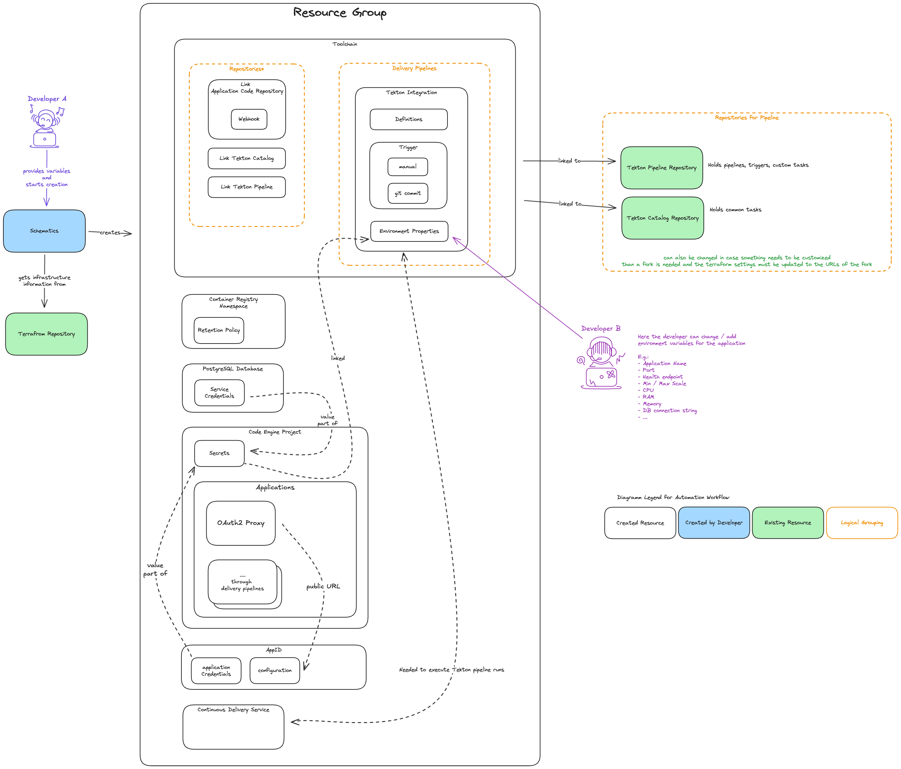

# IBM Cloud Client Engineering MVP Infrastructure

Important:

1. Your IBM account must be connected to the git services you use. [See your connected services here](https://cloud.ibm.com/devop/git).
2. Change the Container Registry Plan if your images are bigger than 1 GB.

Open Issues:

[ ] Change to auth type `pat` to use git token to authenticate so use with service ID api keys is possible.
[ ] No reverse proxy when exposing multiple services with oauth proxy.
[ ] Find a way to store the git token in a secure manner.

## TLDR

Fast start steps either from local machine or from IBM Cloud via **Schematics**.

### Local

Prerequisites:

1. Terraform CLI must be installed
2. Create an IBM Cloud API Key
3. Provide the following values in the `terraform.tfvars` file or when prompted on the cli:
   1. `ibmcloud_api_key` - IBM Cloud API Key
   2. `code_repositories` - URL to the git repository and access token to clone it

```sh
git clone https://github.com/fabianschwab/ic-ce-mvp-infrastructure.git
cd ic-ce-mvp-infrastructure

terraform init
terraform apply
```

### IBM Cloud

Prerequisites:

1. Create an IBM Cloud API Key

Steps:

1. Goto *Platform Automation* --> *Schematics* --> *Terraform*
2. Click *Create Workspace*
3. Provide git repo `https://github.com/fabianschwab/ic-ce-mvp-infrastructure.git` and click *next*
4. Provide a workspace name and click *next*
5. Click *Create*

You be redirected to the workspace page.

1. Goto *Settings* tab and change the variables as needed.
   1. Needed are `ibm_cloud_api_key` and `code_repositories`
2. Click *Plan* and then *Apply*

## Overview

This project is based on the [Develop a Code Engine app](https://cloud.ibm.com/devops/setup/deploy?repository=https%3A%2F%2Feu-de.git.cloud.ibm.com%2Fopen-toolchain%2Fcode-engine-toolchain&env_id=ibm:yp:eu-de) IBM Cloud Toolchain.

It basically does the same only a bit more simplified. E.g. it does not do all the pipeline steps and does not create forks of the repositories for the pipeline.
The aim is to have an easy to use infrastructure for the MVP, which deploys a application based on the `Dockerfile` in the code repository.
OPtionally is also sets up a **PostgreSQL** instance.
The **PostgreSQL** instance is the smallest available plan and the credentials are stored in a **Code Engine** secret and can be used by the application to connect to the database.
The environment variable with the connection string is `POSTGRESQL`.
By default all applications are behind an **OAuth2Proxy** for preventing public accessible MVPs. Only services with `internal` as domain mapping are not exposed through the proxy.
If for some reason no authentication is needed a flag can be set to remove or not set up the **OAuth2Proxy** infrastructure.

This repository contains the infrastructure code as terraform scripts.
It sets up the following resources:

- Resource Group
- Container Registry Namespace
  - Retention Policy (3 images per repository)
  - The name has a random suffix to avoid name collisions
- PostgreSQL Instance (optional)
  - Service Credentials
- Code Engine Project
  - Secrets
    - PostgreSQL (when database it created)
  - Code Engine Applications
    - OAuth Proxy
- Continuous Delivery Service for executing the tekton pipelines
- Toolchain
  - Repositories
    - Links the code repository provided as variable
    - Links the tekton pipeline repository
    - Links the tekton catalog repository
  - Delivery Pipeline
    - Tekton Pipeline Definition
    - Tekton Pipeline Environment Properties
    - Tekton Pipeline Triggers
      - Manuel Trigger
      - Git Trigger for *commit* on `main` branch
- AppID
  - Service Credentials for OAuth2Proxy
  - Valid Redirect URL to proxy

## Create Infrastructure

You can create the infrastructure either from your local machine or from IBM Cloud via **Schematics**.

### IBM Cloud Schematics

1. Login to your IBM Cloud Account
2. Goto *Platform Automation* --> *Schematics* --> *Terraform*
3. Click *Create Workspace*
4. Provide the link to this repository `https://github.com/fabianschwab/ic-ce-mvp-infrastructure.git`
5. Click *Next*
6. Provide a name for the workspace
7. Click *Next*
   1. Select your region e.g. `Frankfurt`
   2. Select your resource group e.g. `Default`
8. *Create*

Your workspace is created and you are redirected to the settings page.

After you have [configured the infrastructure](#configure-infrastructure) you can create it by clicking on the *Plan* button and then *Apply*.
This will create all the resources and but is not yet deploying the application.

### Local with Terraform CLI

1. Clone this repository `git clone https://github.com/fabianschwab/ic-ce-mvp-infrastructure.git`
2. Install the [Terraform CLI](https://developer.hashicorp.com/terraform/install)
3. [Configure the infrastructure](#configure-infrastructure)
   1. Change the values in a `terraform.tfvars` file or provide them when prompted on the cli
4. Run `terraform init` to initialize the terraform provider for IBM Cloud
5. Run `terraform validate` to validate the configuration
6. Run `terraform plan` to see what will be created
7. Run `terraform apply` to create the infrastructure

## Resources

When running this Terraform script, the following resources are created:

1. Resource Group
2. Container Registry Namespace
   - With a retention policy of 3 images per repository
   - The name has a random suffix to avoid collisions
3. PostgreSQL Instance (optional)
   - Service Credentials
4. Code Engine Project
   - Secrets (including PostgreSQL credentials if database is created)
   - Code Engine Applications (including OAuth Proxy)
5. Continuous Delivery Service for executing Tekton pipelines
6. Toolchain
   - Linked Repositories:
     - Code repository (provided as a variable)
     - Tekton pipeline repository
     - Tekton catalog repository
   - Delivery Pipeline:
     - Tekton Pipeline Definition
     - Tekton Pipeline Environment Properties
     - Tekton Pipeline Triggers (Manual and Git trigger for 'main' branch commits)
7. AppID Instance
   - Service Credentials for OAuth2Proxy
   - Valid Redirect URL to proxy



The script also sets up necessary connections between these resources, such as binding the AppID instance to the Code Engine project and configuring the Toolchain with the appropriate repositories and pipeline settings.

## Configure Infrastructure

Before you create all the infrastructure you can modify it by providing a few values.
Most of them have default values and are fine as they are but some needed to be changed.

| Name                        | Description                                                                                                 | Type   | Default                | Sensitive |
| --------------------------- | ----------------------------------------------------------------------------------------------------------- | ------ | ---------------------- | --------- |
| ibm_cloud_api_key           | IAM API Key                                                                                                 | string |                        | true      |
| ibm_region                  | Region and zone the resources should be created in.                                                         | string | eu-de                  |           |
| resource_group_name         | Name of resource group to provision resources.                                                              | string | development            |           |
| code_engine_project_name    | Name for the CodeEngine project which holds the applications                                                | string | mvp-development        |           |
| container_registry_name     | Container registry namespace name which holds the images for the applications                               | string | mvp-images             |           |
| pg_database_name            | Name of the PostgreSQL database service                                                                     | string | mvp-database           |           |
| pg_database_endpoint        | Specify the visibility of the database endpoint. Allowed values: 'private', 'public', 'public-and-private'. | string | private                |           |
| toolchain                   | Name of the automation Toolchain                                                                            | string | code-engine-deployment |           |
| code_repositories           | Information about the code repositories to build                                                            | object |                        |           |
| repository_pipeline         | Repository which holds the tekton pipeline, trigger and so on                                               | object |                        |           |
| repository_pipeline_catalog | A collection of tekton pipeline steps which can be added to the pipeline                                    | object |                        |           |

The `ibm_cloud_api_key` is a value which is sensitive and should be provided as a secret. This api key is also used to deploy the application on code engine, so do not delete it after the infrastructure is created.

The database is not reachable from outside the cloud account for security reasons. If you want to change this, consider changing the `pg_database_endpoint` variable to `public` or `public-and-private`.

### Code Repositories Configuration

The `code_repositories` variable accepts a list of repository configurations with the following structure:

```hcl
code_repositories = [
  {
    url         = string # Repository URL
    token       = string # Access token
    root_folder = string # Root folder containing the source code
    name        = string # Name identifier for the repository
    visibility  = string # Repository visibility: "public", "private", or "project"
  }
]
```

Validation Rules:

- `visibility` must be one of: "public", "private", or "project"

## Configure Code Engine Deployment Pipeline

The Tekton pipeline is configured to build and deploy applications to IBM Code Engine. It uses a container-based build process that creates an image from your application's Dockerfile and deploys it to the Code Engine project. The pipeline is triggered automatically on commits to the main branch or can be run manually through the toolchain interface.

To access and configure the toolchain settings in the IBM Cloud UI:

1. Log in to your IBM Cloud account.
2. Navigate to the "Platform Automation" section in the main menu.
3. Select "Toolchains" from the submenu.
4. Find and click on the toolchain you created for this project.
5. In the toolchain overview, you'll see all the integrated tools, including the Delivery Pipeline.
6. Click on the Delivery Pipeline name to access its settings.
7. In the Delivery Pipeline interface, you can view and edit the pipeline's environment properties, triggers, and stages by clicking in the **Settings** button in the upper right corner.

The following table describes the environment variables that can be configured for the pipeline:

| Variable            | Description                                                                |
| ------------------- | -------------------------------------------------------------------------- |
| app-name            | Name of the application to be deployed in Code Engine                      |
| ibmcloud-api        | IBM Cloud API endpoint for authentication                                  |
| repository          | Git repository URL containing the application code                         |
| branch              | Git branch to build from (defaults to main)                                |
| revision            | Specific git commit hash to build (optional)                               |
| git-token           | Token for Git authentication                                               |
| region              | IBM Cloud region where resources will be deployed                          |
| resource-group      | Resource group containing the Code Engine project                          |
| code-engine-project | Name of the Code Engine project                                            |
| service-bindings    | Semi-colon separated list of service bindings to attach to the application |
| env-from-configmaps | Semi-colon separated list of ConfigMaps to set environment variables from  |
| env-from-secrets    | Semi-colon separated list of Secrets to set environment variables from     |
| cpu                 | Amount of vCPU allocated per instance (default: "0.25")                    |
| memory              | Amount of memory allocated per instance (default: "0.5G")                  |
| ephemeral-storage   | Amount of ephemeral storage per instance (default: "0.4G")                 |
| app-max-scale       | Maximum number of instances to scale to (default: "1")                     |
| app-min-scale       | Minimum number of instances to maintain (default: "0")                     |
| app-port            | Port where the application listens (default: "8080")                       |
| app-visibility      | Application visibility setting - 'public', 'private' or 'project'          |
| pipeline-debug      | Enable debug logging in pipeline (default: "0")                            |

The pipeline automatically manages secure properties through the secure-properties secret, which contains the necessary API keys and credentials for accessing IBM Cloud services. This secret is automatically injected into the pipeline environment by the Continuous Delivery Tekton Pipeline support system.

## Customize Tekton Pipeline

The Tekton pipeline steps and tasks can be customized by modifying the code in the tekton-catalog and tekton-pipeline repositories. To make changes:

1. Fork the tekton-catalog and tekton-pipeline repositories.
2. Modify the pipeline steps and tasks in your forked repositories as needed.
3. Update the `repository_url_pipeline` and `repository_url_pipeline_catalog` variables in the terraform script to point to your forked repositories.
4. Re-run the terraform script to apply the changes to your pipeline.

This process allows you to tailor the pipeline to your specific needs while maintaining the ability to easily update and manage your infrastructure.
